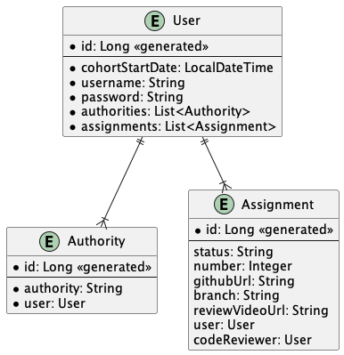
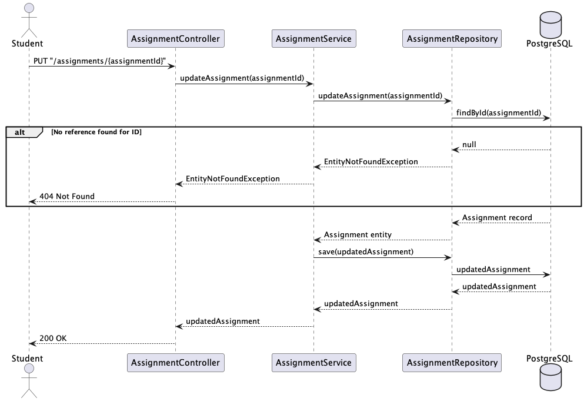
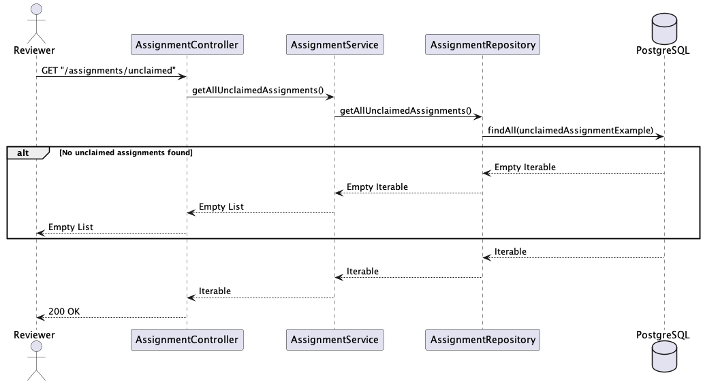
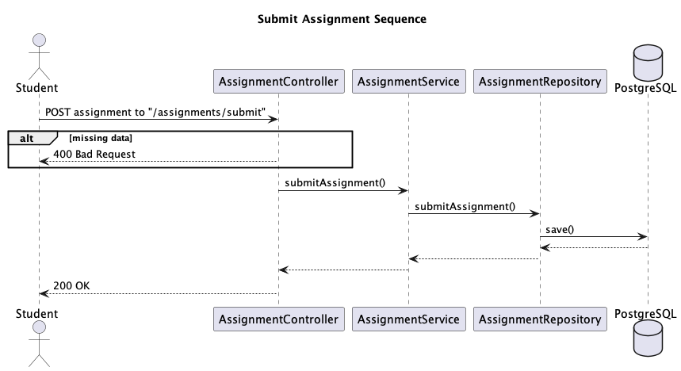
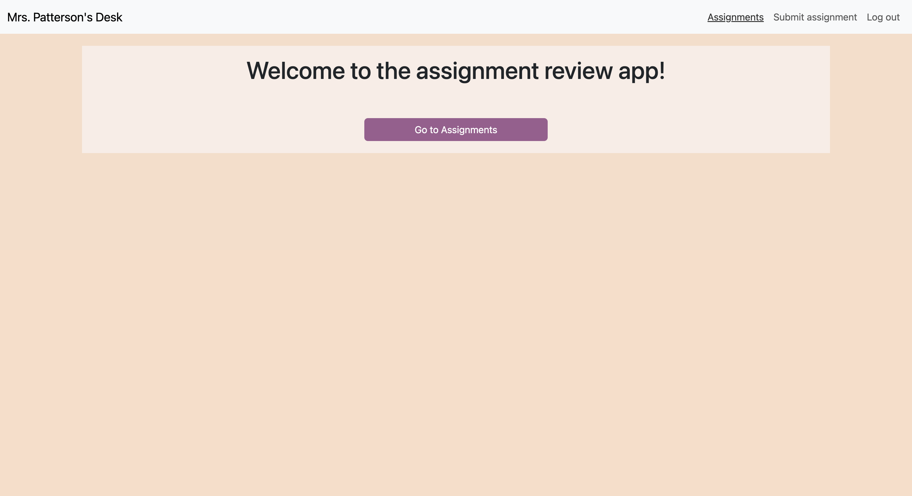
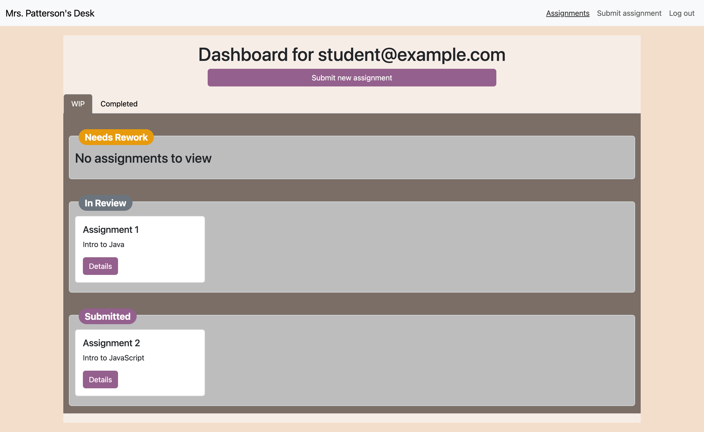
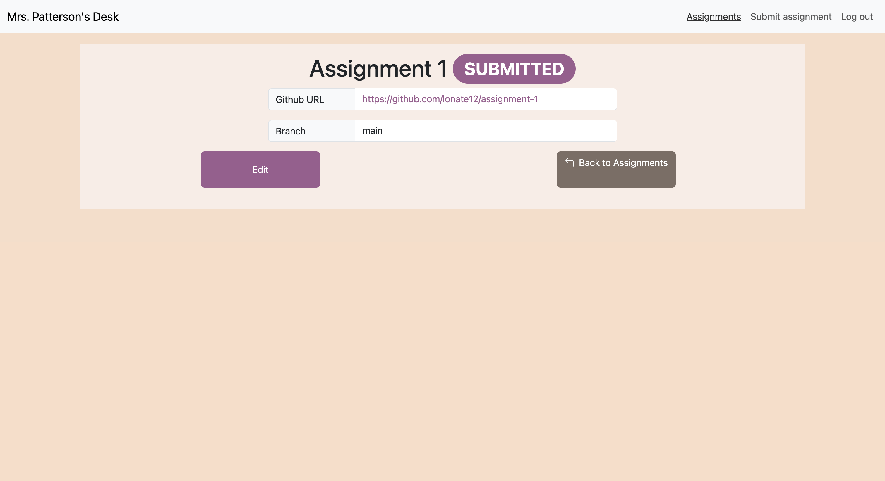

# Learning Management System (LMS) Capstone Project
**Table of Contents**
- [Background](#background)
- [What is it and why?](#what-is-it-and-why)
- [What I did](#what-i-did)
- [Technologies used](#technologies-used)
  - [Frontend](#frontend)
  - [Backend](#backend)
- [How did I go about it?](#how-did-i-go-about-it)
  - [Planning phase](#planning-phase)
  - [Backend](#backend-1)
  - [Frontend](#frontend-1)
  - [Deployment](#deployment)
- [Reflection](#reflection)
- [Roadmap](#improvements-roadmap)

# Background
In June 2023 I decided to upskill myself by going through the
[Bloomtech Backend Engineering course.](https://www.bloomtech.com/courses/backend-development)
The course material was **developed by Amazon** for their
[Amazon Technical Academy](https://amazontechnicalacademy.com/) program that takes employees in
non-tech roles and prepare them to be software engineers at Amazon.

To see a live instance of the app: [Mrs. Patterson's Desk](http://mrs-pattersons-desk-front-end.s3-website.us-east-2.amazonaws.com/)

There are two different personas, use the corresponding logins to view the app from each perspective:

| Persona | Username             | Password |
|---------|----------------------|----------|
| Assignment Reviewer | `reviewer@example.com` | `password` |
| Student | `student@example.com`  | `password` |

# What is it and why?
This is a learning management system where students can submit assignments and reviewers can pick assignments from a queue
to review. This capstone projects serves to demonstrate the application of skills and technologies I've learned while 
in the program.

# What I did
Starting with a [design document](./documents/composition_document.md), it was up to me to implement everything. Where
there were gaps in design decisions or in knowledge about a piece of technology, I either made properly thought through 
design decisions, consulted with stakeholders to ensure design decisions would align with the project requirements that
may have not been laid out in the original design document, or filled in the gaps on my knowledge. While I was made aware
of technologies like Spring Boot in conversations with folks during the course, it was up to me to get up to speed on the
technology, read the documentation, understand what I needed to find out in order to make my project work.

I quickly got up to speed on Spring Security, Spring JPA, and Spring Boot more broadly. When it came time do deploy, I educated
myself about different hosting possibilities and learned about Supabase, Docker, and AWS App Runner (along with other bits
that were needed when dealing with these techs, e.g. AWS CLI, IAM, Amazon ECR, Docker CLI, etc.)

## Technologies Used
### Backend
Java, Spring Boot, Spring Security, PostgreSQL
### Frontend
JavaScript, React, ReactRouter, Bootstrap, JWT, Postman
### Deployment
AWS, AWS App Runner, Docker, ECR, S3, Supabase

# How did I go about it?
### Planning phase
First step was to go through the [design document](./documents/composition_document.md) in order to understand what the requirements
were. This reflects the real-world scenario of what the dev would receive from the product team. From there, I created
an entity diagram:

*Entity Diagram*

Next, thinking through the use cases, I started to work out some flow diagrams, examples below:

*Edit assignment flow*

*Get all unclaimed/pending assignment flow*

*Submit assignment flow*

### Backend
With this in place, I started to code up the backend leveraging Spring Boot with Spring JPA and Spring Security. As I mentioned
earlier, this was new technology to me, so I had to learn as much as needed to get things up and running. Once I had my
backend at a good spot and was able to test it out with Postman, I got to work on the frontend.

### Frontend
Along with the design document, I also received some [wireframes](./documents/images) as to what the frontend should look like. I'm no designer,
so I put together a frontend that with the aim of being functional and live up to the essence of the wireframes. In a real-world
project, I would, likely, receive detailed renderings of what the frontend should look like from a graphic designer.

Some examples of the wireframes and screenshots of the end result:

---
## Authenticated Home Page

*Wireframe*

*Live*

---
## Learner Dashboard Page

*Wireframe*

*Live*

---
## Learner Assignment Detail Page

*Wireframe*

*Live*

---

### Deployment
When it came time to deploy, there was no preference/guidance in the design document. With my previous experience at AWS,
that was the first place I went to. Having previously obtained the 
[AWS Certified Solutions Architect - Associate](https://aws.amazon.com/certification/certified-solutions-architect-associate/)
certification, I knew what general technologies to consider. For the frontend, I settled on serving it as a static website
from an S3 bucket. For the backend, I decided to containerize the application and deploy it via AWS App Runner. For the database,
I opted to use Supabase's free tier. I know the infrastructure is not as hardened as it should be if this was a production
app intended to be used by many thousands (even millions) of users. However, I plan to refresh myself on AWS best practices
in order to make sure I have a cloud architecture that aligns with those pillars.

# Reflection
I'm very proud to present this project as a culmination of what I've learned at Bloomtech. I know there's still a lot to
learn and the tech landscape is ever evolving and evolving faster than we can individually keep up. This is just the start
and I plan to continue to learn and improve on my knowledge.

As far as the app goes, there's plenty of room for improvement (see improvements roadmap below) and I plan to work on 
continuing to improve the app, not because it will actually be used by live users, but in an attempt to continue to 
learn, be curious, and dive deep into new topics that will make me a better technologist.

### Improvements Roadmap
- [ ] Input validation on both the frontend and the backend
- [ ] Email notifications for different events (e.g. assignment marked as complete)
- [ ] Password reset flow
- [ ] Infrastructure improvements (e.g. Cloudfront in front of S3? Load balancer fronting App Runner? CI/CD pipeline?)